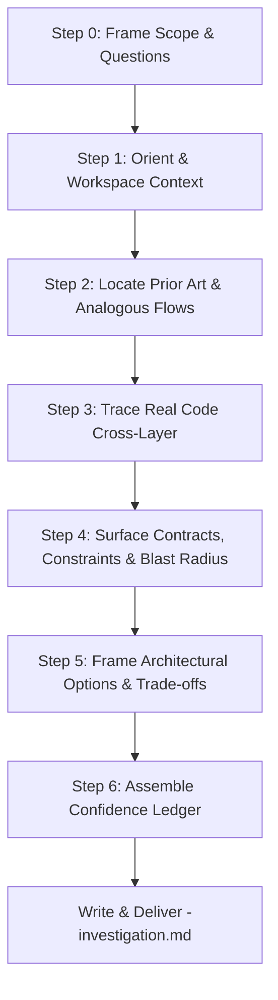

# Skill: `/investigate` — Pre-Plan Research & Discovery

The dedicated reconnaissance pass executed **before** `/plan`. It replaces speculation with verifiable evidence, answering: *"What is actually true in this codebase today, and what are our viable options?"*

A plan built on assumptions breaks down during implementation. This skill guarantees that every assertion is anchored to real code or explicitly quarantined as an unverified inference, handing `/plan` a solid evidence foundation instead of a blank page.

---

## Operating Standards & Invariants

This skill strictly adheres to the **[core](../core/SKILL.md)** operating standards and the **[artifacts](../artifacts/SKILL.md)** delivery protocol.
- **Target Artifact**: `<prefix>-investigation.md` at the **workspace root** (`antigravity-investigation.md` under Antigravity IDE, `claude-investigation.md` under Claude Code).

---

## ⛔ Golden Operational Invariants

> [!CAUTION]
> **ZERO-TOLERANCE RULES — READ-ONLY DISCIPLINE:**
>
> 1. **STRICTLY READ-ONLY**: Never edit source code, scaffold files, stage git changes, run database migrations, or execute mutating commands. The only file this skill creates or modifies is its own workspace artifact: `<prefix>-investigation.md`.
> 2. **DO NOT WRITE THE PLAN**: Deliver current-state findings, architectural options, trade-offs, and a seed outline. Never draft task phases, step-by-step checklists, or `<prefix>-implementation_plan.md`. Solution architecture belongs to `/plan`.
> 3. **NO UNCITED CLAIMS**: Every factual claim about codebase behavior, interfaces, or types must carry a precise `path:line` citation. Deductions must be explicitly marked **Inferred** or **Unknown**.
> 4. **NO AUTO-PROCEED**: Never roll directly from research into planning or implementation without explicit user authorization. Present findings and hand off control.

---

## 1. When to Use

Invoke this skill whenever:
- The user issues `/investigate` (bare or with a topic).
- The user asks: *"Research this"*, *"How does X work before we touch it?"*, *"What would it take to add Y?"*, *"Scope this feature out"*, *"Where is Z defined?"*, or *"Is this approach feasible?"*.
- A feature request or issue description has arrived and the structural blast radius is still undefined.
- An attempt at `/plan` stalled due to missing context or unverified architectural dependencies.

### Skill Neighborhood & Routing

| Objective / Context | Correct Skill |
|---|---|
| Deep-dive research, ground truth, and options **before** designing a change | **`/investigate`** (this skill) |
| Synthesizing gathered evidence into a phased task plan | [`/plan`](../plan/SKILL.md) |
| Explaining an isolated symbol, expression, error, or PR comment | [`/explain`](../explain/SKILL.md) |
| Diagnosing an active regression, failing test, or runtime crash | [`/problem`](../problem/SKILL.md) |
| Auditing an existing plan or pull request diff | [`/review`](../review/SKILL.md) or [`/code-review`](../code-review/SKILL.md) |
| Auditing a proposed architecture for hidden edge cases and failure modes | [`/what-am-I-missing`](../what-am-I-missing/SKILL.md) |

---

## 2. Invocation Modes

### Case A: Bare Command (`/investigate` with no arguments)

When the user runs `/investigate` without instructions:

1. **Locate Existing Investigation**:
   - Check for `<prefix>-investigation.md` at the **workspace root**.
2. **If Found**:
   - Immediately output a direct clickable IDE link and key section anchors (`#L<line>`):
     ```markdown
     Here is the active investigation:

     📄 **[<prefix>-investigation.md](file://<workspace-root>/<prefix>-investigation.md)** (or relative link under Claude Code)

     ### Key Sections:
     - 📄 [TL;DR](file://<workspace-root>/<prefix>-investigation.md#L16)
     - 📄 [Current-State Architecture](file://<workspace-root>/<prefix>-investigation.md#L32)
     - 📄 [Options & Trade-offs](file://<workspace-root>/<prefix>-investigation.md#L78)
     - 📄 [Confidence Ledger](file://<workspace-root>/<prefix>-investigation.md#L110)
     - 📄 [Plan Seed](file://<workspace-root>/<prefix>-investigation.md#L135)

     **Status:** Complete | Blocked on open questions
     ```
3. **If Not Found**:
   - Inform the user that no active investigation exists for this workspace.
   - Prompt them for the topic, module, or feature they would like to investigate.

---

### Case B: Command With Instructions (`/investigate <topic>`)

When the user supplies a topic or goal (e.g. `/investigate multi-tenant webhook dispatching`):
Execute the complete **Investigation Protocol** below.

---

## 3. The 7-Step Investigation Protocol



### Step 0 — Frame the Scope & Questions
Before reading code, establish strict research boundaries to avoid sprawling:
1. **Goal**: Restate the inquiry in one concise, unambiguous sentence.
2. **Core Questions**: Define 3–7 precise questions that must be resolved before a plan can be drafted.
3. **Done Condition**: Specify the clear boundary where investigation ends (e.g., "Identified exact database schema, call flow from controller to worker, and existing test patterns").

### Step 1 — Orient & Recover Context
1. **Workspace Rulebooks**: Check `CLAUDE.md`, `GEMINI.md`, and `.agents/rules/` for global architectural patterns, forbidden libraries, or repository constraints.
2. **Project-Scoped Skills**: Identify and load relevant domain skills per the [core precedence model](../core/SKILL.md) (e.g. `Projects/GR.PRIIS/backend-fastendpoints`, `frontend-rtk-query`).
3. **Repository Topology**: Determine if the change crosses repository or package boundaries (e.g., Backend API, Frontend SPA, Shared Contracts, Shared Worker).
4. **Historical Decisions**: Inspect recent commits (`git log -n 5 -p`) and search past conversational transcripts (`<appDataDir>/brain/` or `~/.claude/projects/`) to honor established decisions and avoid relitigating resolved debates.

### Step 2 — Locate Prior Art & Reference Patterns
Codebases thrive on consistency. The most reliable pattern is usually the one already proven in a sibling feature:
- Locate the nearest analogous implementation (e.g., sibling endpoint, existing form, matching domain event, existing migration).
- Read the reference flow across every layer it touches.
- Identify competing or inconsistent patterns in the codebase. Clearly document which one represents modern repository consensus and why.

### Step 3 — Trace Real Code Cross-Layer (No Guesswork)
Inspect actual source code definitions rather than making assumptions based on file or variable names:
- **Enclosing Scope**: Inspect full class definitions, lifecycles, and middlewares—not just isolated snippets.
- **Cross-Layer Mapping**:
  - *API ↔ UI*: Route path, query params, DTO payload schemas, serialization settings, and client state/queries.
  - *Domain ↔ Storage*: Entity definitions, database contexts, foreign keys, cascade configurations, and migrations.
  - *Runtime ↔ Config*: Environment settings, dependency injection registrations, and background schedulers.
- **Existing Test Coverage**: Locate unit and integration tests covering this flow. If tests do not exist, document that absence as a critical finding.

### Step 4 — Surface Contracts, Constraints & Blast Radius
Map out what could break:
- **Blast Radius**: Enumerate all direct callers, downstream subscribers, consumers, and external webhooks.
- **Data & Migration Risks**: Identify schema locks, breaking column drops, data backfill requirements, or nullable transitions.
- **Third-Party & Network Boundaries**: Identify external APIs, timeouts, fallback policies, and retry behaviors.
- **Auth & Access Control**: Check role-based or tenant authorization gates protecting the target pathways.

### Step 5 — Frame Architectural Options (Not the Plan)
Present 2–3 viable, contrasting implementation approaches:
- **Approach Summary**: High-level structural description (where state lives, how events flow).
- **Trade-offs**: Complexity, performance, blast radius, migration burden, and reversibility.
- **Prior Art Reference**: Which existing pattern or file each option resembles.
- **Recommendation & Rationale**: Explicitly designate the recommended option and justify why it wins.

### Step 6 — Assemble the Confidence Ledger
Classify every key finding into one of three strict categories:
- ✅ **Verified**: Confirmed by inspecting specific code (`path/to/file.ext:L12-L34`).
- 🟡 **Inferred**: Plausible deduction based on convention or partial evidence. Include explicit instructions on how to verify before implementation.
- ❓ **Unknown**: Information missing from the codebase (e.g. business logic decisions, external service credentials). Document who owns the decision and whether it blocks planning.

---

## 4. Workspace Artifact Specification

Save the investigation artifact directly to the **workspace root** using the host prefix:
- **Antigravity IDE**: `<workspace-root>/antigravity-investigation.md`
- **Claude Code**: `<workspace-root>/claude-investigation.md`

### Artifact Template

```markdown
# Investigation: <Topic Name>

**Goal:** <One-sentence restatement of user goal>  
**Scope:** <Repositories, microservices, domains, or directories touched>  
**Status:** Complete | Blocked on open questions  
**Date:** <YYYY-MM-DD>  

---

## 1. Questions Answered
1. **<Question 1>?** → <Direct, concise answer with source citation>
2. **<Question 2>?** → <Direct, concise answer with source citation>

---

## 2. Executive Summary (TL;DR)
- <Key finding 1: current state truth>
- <Key finding 2: primary constraint or contract>
- <Key finding 3: recommended architectural direction>

---

## 3. Current-State Architecture & Code Map
<Walkthrough of the active implementation, including data flow, call sequences, and file links.>

| Component / Layer | Source Location | Responsibilities |
|---|---|---|
| Controller / Endpoint | `path/to/File.cs:L20` | Handles request dispatch and validation |
| Domain Service | `path/to/Service.cs:L45` | Business invariants and transaction boundary |

---

## 4. Prior Art & Reference Patterns
- **Primary Reference**: `path/to/SiblingFeature.cs:L30` — cleanest pattern to mirror.
- **Pattern Inconsistencies**: <Notes on legacy vs modern patterns if both exist in the repo.>

---

## 5. Constraints & Contracts
| Constraint Category | Impact / Requirement | Source Evidence |
|---|---|---|
| Schema & Migration | Requires non-nullable column backfill | `src/Db/Migration.cs:L12` |
| Cross-Service API | Downstream consumer expects fixed JSON format | `src/Contracts/Event.cs:L8` |

---

## 6. Blast Radius
- **Direct Callers**: <List of calling methods/components with file links>
- **Shared State / Persistence**: <Tables, caches, or stores affected>
- **Existing Test Coverage**: <Paths to unit/integration test suites, or "None found">

---

## 7. Options & Trade-offs

### Option A: <Name> (Recommended)
- **Concept:** <One-sentence summary>
- **Pros:** ...
- **Cons:** ...
- **Follows:** `path/to/Reference.cs`

### Option B: <Name>
- **Concept:** <One-sentence summary>
- **Pros:** ...
- **Cons:** ...
- **Follows:** ...

**Recommendation:** <Why Option A is selected over alternatives.>

---

## 8. Confidence Ledger
| Finding / Assumption | Level | Evidence / Verification Method |
|---|---|---|
| Existing handler uses optimistic locking | ✅ Verified | `src/Handlers/OrderHandler.cs:L55` |
| Legacy background job runs every 15 mins | 🟡 Inferred | Cron schedule in `appsettings.json`, needs runtime check |
| Third-party API rate limits for webhook | ❓ Unknown | External vendor docs needed; non-blocking for scaffolding |

---

## 9. Open Questions for User
<Decisions that belong exclusively to the user, or genuine blockers. Leave empty if none.>

---

## 10. Plan Seed
<High-level structural outline for /plan to build upon. No phases, no task lists, no code snippets.>
- 1. Define domain contracts and event schemas adhering to Option A.
- 2. Add database schema migration with backward-compatible defaults.
- 3. Implement business handler mirroring prior art in `SiblingFeature.cs`.
- 4. Wire client state hook and update frontend component.
```

---

## 5. Chat Response Protocol

Per [core §1.3](../core/SKILL.md), chat output must remain concise and high-signal, pointing directly to the artifact:

1. **Headline**: 1–2 sentences summarizing the most critical finding or recommended direction.
2. **Clickable Artifact Link**:
   - **Antigravity IDE**: `📄 [antigravity-investigation.md](file://<workspace-root>/antigravity-investigation.md)`
   - **Claude Code**: `📄 [claude-investigation.md](claude-investigation.md)`
3. **Section Anchors**: Read exact line numbers (`grep -n '^#\{1,3\} ' <prefix>-investigation.md`) and output clickable links to:
   - `[Executive Summary]`
   - `[Options & Trade-offs]`
   - `[Confidence Ledger]`
   - `[Plan Seed]`
4. **Primary Recommendation**: State the winning approach in one sentence.
5. **Open Questions**: Surface blocking user decisions directly in chat.
6. **Standard Handoff Line**:
   ```markdown
   **Next Step:** Type `/plan` to convert the Plan Seed into a detailed implementation plan, or `/what-am-I-missing` for a blind-spot review.
   ```

---

## 6. Pre-Handoff Quality Checklist

Confirm every item before finalizing the response:
- [ ] Strictly read-only: zero modifications to application source code or repository configuration.
- [ ] No implementation plan was written: options and architecture seeds provided, no task phases.
- [ ] Every factual statement contains a workspace-relative `path:line` citation.
- [ ] Inferred assertions and unknown dependencies are documented in the Confidence Ledger.
- [ ] Rulebooks (`CLAUDE.md`/`GEMINI.md`) and project-scoped skills were verified.
- [ ] Target artifact was written directly to the workspace root using the correct host prefix.
- [ ] Chat links and section anchors (`#L<line>`) were verified via grep.
- [ ] Explicit handoff presented without auto-proceeding.
