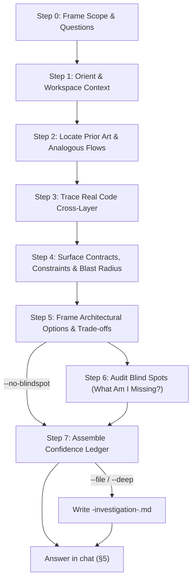

# Skill: `/investigate` — Pre-Plan Research & Discovery

The dedicated reconnaissance pass executed **before** `/plan`. It replaces speculation with verifiable evidence, answering: _"What is actually true in this codebase today, what are our viable options, and what critical traps are we missing?"_

A plan built on assumptions breaks down during implementation. This skill guarantees that every assertion is anchored to real code or explicitly quarantined as an unverified inference, performs an adversarial blind-spot audit on request (incorporating the `/what-am-I-missing` flow), and hands `/plan` an evidence foundation instead of a blank page. Plain runs answer in chat; the flags in §2 add the audit and the artifact.

---

## Modules

Paths are relative to this skill's real folder. Run `realpath` on the skill's base directory once (it may be a symlink), then resolve each path from there. If any Module cannot be read, stop and report the path. Do not continue without it.

Read these before step 1:

- `../_modules/core.md`: read-only until `/proceed`
- `../_modules/artifact-protocol.md`: writes `<prefix>-investigation-<suffix>.md` at the **workspace root** only under `--file` or `--deep` (suffix e.g. `-draft-close-dialog`, `-municipality-sync`); a plain run writes nothing

Read these only when their flag is given:

- `../_modules/pr-host.md` (`--from`): read-only, to resolve the PR or work item and its acceptance criteria
- `../_modules/git-worktrees.md` (`/worktrees`): snapshot mode, per `core` › _Worktree opt-in_

---

## ⛔ Golden Operational Invariants

> [!CAUTION]
> **ZERO-TOLERANCE RULES — READ-ONLY DISCIPLINE:**
>
> 1. **STRICTLY READ-ONLY**: Never edit source code, scaffold files, stage git changes, run database migrations, or execute mutating commands. The only file this skill creates or modifies is its own workspace artifact, `<prefix>-investigation-<suffix>.md`, and only under `--file` or `--deep`.
> 2. **DO NOT WRITE THE PLAN**: Deliver current-state findings, architectural options, trade-offs, and a seed outline. Never draft task phases, step-by-step checklists, or `<prefix>-implementation_plan-<suffix>.md`. Solution architecture belongs to `/plan`.
> 3. **NO UNCITED CLAIMS**: Every factual claim about codebase behavior, interfaces, or types must carry a precise `path:line` citation. Deductions must be explicitly marked **Inferred** or **Unknown**.
> 4. **NO AUTO-PROCEED**: Never roll directly from research into planning or implementation without explicit user authorization. Present findings and hand off control.

---

## 1. When to Use

### Skill Neighborhood & Routing

| Objective / Context                                                                               | Correct Skill                                                                                          |
| ------------------------------------------------------------------------------------------------- | ------------------------------------------------------------------------------------------------------ |
| Deep-dive research, ground truth, options, and critical blind spots **before** designing a change | **`/investigate`** (this skill; includes the `/what-am-I-missing` audit unless `--no-blindspot`)       |
| Synthesizing gathered evidence into a phased task plan                                            | [`/plan`](../plan/SKILL.md)                                                                            |
| Explaining an isolated symbol, expression, error, or PR comment                                   | [`/explain`](../explain/SKILL.md)                                                                      |
| Diagnosing an active regression, failing test, or runtime crash                                   | [`/problem`](../problem/SKILL.md)                                                                      |
| Auditing an existing plan or pull request diff                                                    | [`/plan --review`](../plan/SKILL.md) (plans) or [`/code-review`](../code-review/SKILL.md) (diffs) |
| Standalone blind-spot audit of an already-chosen approach, plan, or diff                          | [`/what-am-I-missing`](../what-am-I-missing/SKILL.md)                                                  |
| Another visual angle on a finished investigation (a different diagram, a diff, an HTML view)      | `/show-me` (`~/.agents/skills/show-me/`, user-invoked only; see §4 _Visuals_)                          |

---

## 2. Invocation Modes

### Case A: Bare Command (`/investigate` with no arguments)

When the user runs `/investigate` without instructions:

1. **Locate Existing Investigation**:
   - Check for `<prefix>-investigation-*.md` at the **workspace root**.
   - **Several found**: pick the one whose suffix carries the work-item ID from the current branch name (e.g. `feature/22470_…` → `-22470-`); otherwise the most recently modified. List the other two most recent ones below the link so the user can switch.
2. **If Found**:
   - Read the real anchor lines first (`grep -n '^#\{1,3\} ' <file>`); never reuse the example line numbers below.
   - Immediately output a direct clickable IDE link and key section anchors (`#L<line>`):
     ```markdown
     Here is the active investigation:

     📄 **[<prefix>-investigation-<suffix>.md](file://<workspace-root>/<prefix>-investigation-<suffix>.md)** (or the Claude Code link format from `artifact-protocol`)

     ### Key Sections:

     - 📄 [TL;DR](file://<workspace-root>/<prefix>-investigation-<suffix>.md#L16)
     - 📄 [Current-State Architecture](file://<workspace-root>/<prefix>-investigation-<suffix>.md#L32)
     - 📄 [Options & Trade-offs](file://<workspace-root>/<prefix>-investigation-<suffix>.md#L78)
     - 📄 [Blind Spots (What Am I Missing?)](file://<workspace-root>/<prefix>-investigation-<suffix>.md#L95)
     - 📄 [Confidence Ledger](file://<workspace-root>/<prefix>-investigation-<suffix>.md#L120)
     - 📄 [Plan Seed](file://<workspace-root>/<prefix>-investigation-<suffix>.md#L145)

     **Status:** Complete | Blocked on open questions
     ```
3. **If Not Found**:
   - Inform the user that no active investigation exists for this workspace.
   - Prompt them for the topic, module, or feature they would like to investigate.

---

### Case B: Command With Instructions (`/investigate <topic>`)

When the user supplies a topic or goal (e.g. `/investigate multi-tenant webhook dispatching`), or `--from` alone, execute the **Investigation Protocol** below with the flags given.

### Flags

| Flag                     | Effect                                                                                                                                                                                                 |
| ------------------------ | ------------------------------------------------------------------------------------------------------------------------------------------------------------------------------------------------------ |
| _(none)_                 | Steps 0–7, blind-spot audit included; answer in chat per §5 _Chat-only response_. No file                                                                                                              |
| `--no-blindspot`         | Skips Step 6, the blind-spot audit                                                                                                                                                                     |
| `--file`                 | Writes the §4 artifact and answers per §5 _Artifact response_                                                                                                                                          |
| `--deep`                 | The full protocol: `--file` with the audit. With `--no-blindspot` it contradicts itself, so ask which applies                                                                                          |
| `--from <PR\|work item>` | Frames Step 0 from a PR or work item (URL, id, `#30342`). The topic becomes optional                                                                                                                   |
| `--scope <path>…`        | Bounds Steps 2–4 to these paths (repo, directory or package); see Step 0                                                                                                                               |
| `/worktrees`             | Reads a pinned snapshot instead of the live checkout (`git-worktrees` › _Snapshot Lifecycle_). With `--from <PR>`, the snapshot is the PR head, so the findings describe the PR, not your working tree |

Flags combine and their order does not matter. An unknown `--flag` is a question, not a guess.

---

## 3. The 8-Step Investigation Protocol


```mermaid
flowchart TD
    S0["Step 0: Frame Scope & Questions"] --> S1["Step 1: Orient & Workspace Context"]
    S1 --> S2["Step 2: Locate Prior Art & Analogous Flows"]
    S2 --> S3["Step 3: Trace Real Code Cross-Layer"]
    S3 --> S4["Step 4: Surface Contracts, Constraints & Blast Radius"]
    S4 --> S5["Step 5: Frame Architectural Options & Trade-offs"]
    S5 --> S6["Step 6: Audit Blind Spots (What Am I Missing?)"]
    S5 -->|"--no-blindspot"| S7["Step 7: Assemble Confidence Ledger"]
    S6 --> S7
    S7 -->|"--file / --deep"| Art["Write <prefix>-investigation-<suffix>.md"]
    S7 --> Chat["Answer in chat (§5)"]
    Art --> Chat
```

### Step 0 — Frame the Scope & Questions

Before reading code, establish strict research boundaries to avoid sprawling:

0. **Intake (`--from` only)**: Resolve the PR or work item per `pr-host` › _Parse a PR or work-item URL_ and _Fetch the PR, its work items and acceptance criteria_ (a work item without a PR is fine; read the item and its parent). Derive the goal and questions from its title, description and acceptance criteria, and cite them. The description states intent; the code states truth. A failed fetch follows `pr-host` › _When a fetch fails_; do not invent the ticket's content.
1. **Goal**: Restate the inquiry in one concise, unambiguous sentence.
2. **Core Questions**: Define 3–7 precise questions that must be resolved before a plan can be drafted.
3. **Done Condition**: Specify the clear boundary where investigation ends (e.g., "Identified exact database schema, call flow from controller to worker, and existing test patterns").
4. **Scope Boundary (`--scope` only)**: Steps 2–4 search and trace only under the given paths. A caller, consumer or contract outside them is listed in Blast Radius as _outside scope_ with its `path:line`, not traced further. Rulebooks (Step 1) are still read for the whole workspace.

### Step 1 — Orient & Recover Context

1. **Workspace Rulebooks**: Check `CLAUDE.md` (and `AGENTS.md` where present; `GEMINI.md` on Antigravity) at the workspace root and in each repo it touches, plus the rulebooks they link to, for global architectural patterns, forbidden libraries, or repository constraints.
2. **Project-Scoped Skills**: Identify and load relevant domain skills per `core` › _Precedence_ (e.g. `Projects/GR.PRIIS/priis-backend-fastendpoints`, `priis-frontend-rtk-query`).
3. **Repository Topology**: Determine if the change crosses repository or package boundaries (e.g., Backend API, Frontend SPA, Shared Contracts, Shared Worker).
4. **Historical Decisions**: Inspect commits scoped to the topic (`git log --oneline -n 20 -- <paths>`, or `git log -S <symbol>`; open a diff only for the commits that matter), search claude-mem when its search tools are available, and fall back to past transcripts (`<appDataDir>/brain/` or `~/.claude/projects/`). Honor established decisions and avoid relitigating resolved debates. Memory is compressed and can lag: use it to find a decision, then cite the code or commit that proves it.

### Step 2 — Locate Prior Art & Reference Patterns

Codebases thrive on consistency. The most reliable pattern is usually the one already proven in a sibling feature:

- Locate the nearest analogous implementation (e.g., sibling endpoint, existing form, matching domain event, existing migration).
- Read the reference flow across every layer it touches.
- Identify competing or inconsistent patterns in the codebase. Clearly document which one represents modern repository consensus and why.

### Step 3 — Trace Real Code Cross-Layer (No Guesswork)

Inspect actual source code definitions rather than making assumptions based on file or variable names:

- **Navigation**: Use the code index where one exists (a `.codegraph/` directory in the workspace or a parent): map with its lean commands, walk callers and callees level by level, then read only the line ranges you cite. Grep what the index does not connect: DI and startup wiring, implicit pipeline steps, enum-member usages and config files, plus any gaps the workspace `CLAUDE.md` lists. A trace is finished only when every node has a `path:line`.

- **Enclosing Scope**: Inspect full class definitions, lifecycles, and middlewares—not just isolated snippets.
- **Cross-Layer Mapping**:
  - _API ↔ UI_: Route path, query params, DTO payload schemas, serialization settings, and client state/queries.
  - _Domain ↔ Storage_: Entity definitions, database contexts, foreign keys, cascade configurations, and migrations.
  - _Runtime ↔ Config_: Environment settings, dependency injection registrations, and background schedulers.
- **Existing Test Coverage**: Locate unit and integration tests covering this flow. If tests do not exist, document that absence as a critical finding.

### Step 4 — Surface Contracts, Constraints & Blast Radius

Map out what could break:

- **Blast Radius**: Enumerate all direct callers, downstream subscribers, consumers, and external webhooks.
- **Data & Migration Risks**: Identify schema locks, breaking column drops, data backfill requirements, or nullable transitions.
- **Third-Party & Network Boundaries**: Identify external APIs, timeouts, fallback policies, and retry behaviors.
- **Auth & Access Control**: Check role-based or tenant authorization gates protecting the target pathways.

### Step 5 — Frame Architectural Options (Not the Plan)

Present 2–3 viable, contrasting implementation approaches:

- **Approach Summary**: High-level structural description (where state lives, how events flow).
- **Trade-offs**: Complexity, performance, blast radius, migration burden, and reversibility.
- **Prior Art Reference**: Which existing pattern or file each option resembles.
- **Recommendation & Rationale**: Explicitly designate the recommended option and justify why it wins.

### Step 6 — Audit Blind Spots & Critical Omissions (skipped under `--no-blindspot`)

Under `--no-blindspot` the artifact's §8 says _Not run_ and the handoff offers a re-run without the flag or `/what-am-I-missing`.

Read `../what-am-I-missing/SKILL.md` › _Universal Investigation Protocol_ (stop and report the path if it cannot be read) and audit the leading/recommended option against its **7 Universal Blindspot Vectors**. That skill owns the vectors; do not keep a copy here.

Identify and record:

- 🎯 **The #1 Primary Blind Spot**: The single most critical unstated assumption or hidden invariant.
- 💥 **Blast Radius / Failure Scenario**: Trigger condition, concrete impact, and why it went unnoticed.
- 🔍 **Secondary Blind Spots**: 1–2 additional high-probability edge cases.
- 🛠️ **Actionable Fix & Prevention**: Immediate fix for the plan seed plus structural/type-level prevention.

### Step 7 — Assemble the Confidence Ledger

Classify every key finding into one of three strict categories:

- ✅ **Verified**: Confirmed by inspecting specific code (`path/to/file.ext:L12-L34`).
- 🟡 **Inferred**: Plausible deduction based on convention or partial evidence. Include explicit instructions on how to verify before implementation.
- ❓ **Unknown**: Information missing from the codebase (e.g. business logic decisions, external service credentials). Document who owns the decision and whether it blocks planning.

---

## 4. Workspace Artifact Specification

Only under `--file` or `--deep`. Save the investigation artifact directly to the **workspace root** using the host and model prefix:

- **Antigravity IDE**: `<workspace-root>/antigravity-<model>-investigation-<suffix>.md`
- **Claude Code**: `<workspace-root>/claude-<model>-investigation-<suffix>.md`

### Length Budget

Aim for **at most ~250 lines and ~30 KB**. Past investigations that served `/plan` well ran 70–270 lines; the one that ran 1,500 lines (430 KB) did so through per-item inventories.

- **No per-item inventories.** For a list of many similar items (tests, endpoints, call sites, files), give the count, a table of the few that decide the options, and the command that regenerates the full list (e.g. `grep -rln '<pattern>' <dir> | wc -l`).
- **Cite, don't paste.** A `path:line` replaces a code excerpt; quote at most a few lines, only where the exact text is the finding.
- Over budget after trimming? Say so in the chat response, with the reason, instead of shipping it silently.

### Artifact Template

```markdown
# Investigation: <Topic Name>

**Goal:** <One-sentence restatement of user goal>  
**Scope:** <Repositories, microservices, domains, or directories touched; `--scope` paths when given>  
**Source:** <`--from` PR / work item link, or "topic"> · **Read from:** <live checkout | snapshot `<ref>@<short-sha>`> · **Flags:** <as invoked>  
**Status:** Complete | Blocked on open questions  
**Date:** <YYYY-MM-DD>

---

## 1. Questions Answered

1. **<Question 1>?** → <Direct, concise answer with source citation>
2. **<Question 2>?** → <Direct, concise answer with source citation>

---

## 2. Executive Summary (TL;DR)

- <Key finding 1: current state truth>
- <Key finding 2: primary constraint or contract>
- <Key finding 3: recommended architectural direction>

---

## 3. Current-State Architecture & Code Map

<Walkthrough of the active implementation, including data flow, call sequences, and file links.>

<One visual of the flow, per _Visuals_: a Mermaid sequenceDiagram or a call tree.>

| Component / Layer     | Source Location          | Responsibilities                             |
| --------------------- | ------------------------ | -------------------------------------------- |
| Controller / Endpoint | `path/to/File.cs:L20`    | Handles request dispatch and validation      |
| Domain Service        | `path/to/Service.cs:L45` | Business invariants and transaction boundary |

---

## 4. Prior Art & Reference Patterns

- **Primary Reference**: `path/to/SiblingFeature.cs:L30` — cleanest pattern to mirror.
- **Pattern Inconsistencies**: <Notes on legacy vs modern patterns if both exist in the repo.>

---

## 5. Constraints & Contracts

| Constraint Category | Impact / Requirement                          | Source Evidence             |
| ------------------- | --------------------------------------------- | --------------------------- |
| Schema & Migration  | Requires non-nullable column backfill         | `src/Db/Migration.cs:L12`   |
| Cross-Service API   | Downstream consumer expects fixed JSON format | `src/Contracts/Event.cs:L8` |

---

## 6. Blast Radius

- **Direct Callers**: <List of calling methods/components with file links>
- **Shared State / Persistence**: <Tables, caches, or stores affected>
- **Existing Test Coverage**: <Paths to unit/integration test suites, or "None found">

---

## 7. Options & Trade-offs

### Option A: <Name> (Recommended)

- **Concept:** <One-sentence summary>
- **Pros:** ...
- **Cons:** ...
- **Follows:** `path/to/Reference.cs`

<A `diff` of the call tree, state flow, or file tree this option changes, per _Visuals_.>

### Option B: <Name>

- **Concept:** <One-sentence summary>
- **Pros:** ...
- **Cons:** ...
- **Follows:** ...

**Recommendation:** <Why Option A is selected over alternatives.>

---

## 8. Blind Spots & Critical Omission Analysis (What Am I Missing?)

<Under `--no-blindspot`: the single line "_Not run (`--no-blindspot`). Re-run without it, or `/what-am-I-missing` on the recommended option._" and nothing else in this section. The heading stays so section numbers and anchors are stable.>

### 🎯 The #1 Most Important Thing You Are Missing

> **[One bold, unambiguous sentence identifying the primary blind spot or hidden invariant]**

[Direct technical explanation: What is the unstated assumption or hidden invariant, why does it exist, and why is it easy to overlook?]

#### 💥 The Failure Scenario

- **Trigger:** [Exact condition, user action, edge case, or production event]
- **Impact:** [Precise exception, data corruption, security vulnerability, or performance cliff]
- **Why it went unnoticed:** [Why surface-level code inspection or existing tests didn't catch it]

#### 🔍 Secondary Blind Spots & Nuances

1. **[Secondary Risk 1]:** [Concise explanation of related implication]
2. **[Secondary Risk 2]:** [Concise explanation of related implication]

#### 🛠️ Actionable Recommendation

1. **Immediate Fix:** [Concrete step to eliminate the #1 blind spot in the plan seed]
2. **Structural Prevention:** [How to make this impossible to get wrong via types, architecture, or invariants]

---

## 9. Confidence Ledger

| Finding / Assumption                     | Level       | Evidence / Verification Method                            |
| ---------------------------------------- | ----------- | --------------------------------------------------------- |
| Existing handler uses optimistic locking | ✅ Verified | `src/Handlers/OrderHandler.cs:L55`                        |
| Legacy background job runs every 15 mins | 🟡 Inferred | Cron schedule in `appsettings.json`, needs runtime check  |
| Third-party API rate limits for webhook  | ❓ Unknown  | External vendor docs needed; non-blocking for scaffolding |

---

## 10. Open Questions for User

<Decisions that belong exclusively to the user, or genuine blockers. Leave empty if none.>

---

## 11. Plan Seed

<High-level structural outline for /plan to build upon. No phases, no task lists, no code snippets.>

- 1. Define domain contracts and event schemas adhering to Option A.
- 2. Add database schema migration with backward-compatible defaults.
- 3. Implement business handler mirroring prior art in `SiblingFeature.cs`.
- 4. Wire client state hook and update frontend component.
```

### Visuals

The rules below are the binding ones for this artifact. They adapt the `/show-me` view rules; `/show-me` (`~/.agents/skills/show-me/SKILL.md`) sets `disable-model-invocation: true`, so only the user can run it, which the handoff offers.

Pick the smallest view that makes each point clear, at most three per artifact:

| Section               | Point to make                                                                                                          | View                                                   |
| --------------------- | ---------------------------------------------------------------------------------------------------------------------- | ------------------------------------------------------ |
| §3 Current-State      | Interaction across components, threads, or processes, or anything where order matters (races, retries, async handoffs) | Mermaid `sequenceDiagram`                              |
| §3 Current-State      | Control flow within one process                                                                                        | Call tree in a `text` block                            |
| §7 Recommended option | What the option changes                                                                                                | `diff` of that call tree, state flow, or file tree     |
| §8 Failure scenario   | The trigger, when it depends on timing and the §3 visual does not already show it                                      | Mermaid `sequenceDiagram` with a `Note` at the failure |

- Every node in a visual is a symbol from the §3 code map table, so each one traces to a `path:line`. A visual never carries a claim that the text does not cite.
- Keep only the calls, files, and boundaries needed for the point. Use real names, not placeholders.
- The §7 `diff` shows shape (calls, states, files), not implementation code. The Plan Seed stays free of code.
- Skip visuals when the answer is a single fact that one cited sentence already states.

---

## 5. Chat Response Protocol

Per `core` › _Golden invariants_ (3), chat output must remain concise and high-signal. Every claim carries its `path:line` in both formats.

### Chat-only response (neither `--file` nor `--deep`)

The chat is the deliverable, so it carries the findings the artifact would have, trimmed to what decides the options:

1. **Headline**: 1–2 sentences with the most critical finding and the primary direction, then one visual per §4 _Visuals_ when it earns its place.
2. **Questions Answered**: the Step 0 questions, one line each with its citation.
3. **Code Map**: a compact table (component, `path:line`, role). With `--scope`, list _outside scope_ dependencies on one line.
4. **Options**: numbered, recommended first, one line each with its precedent; then the recommendation and why.
5. **#1 Blind Spot** (unless `--no-blindspot`): the bold sentence, trigger and fix.
6. **Confidence Ledger**: the 🟡 Inferred and ❓ Unknown rows only (with how to verify / owner); state the count of ✅ Verified findings.
7. **Open Questions**: blocking user decisions.
8. **Handoff Line**:
   ```markdown
   **Next Step:** `/plan <suffix>` drafts a plan from these findings in this session; re-run with `--file` (or `--deep`) to keep them for a new session.
   ```

### Artifact response (`--file` or `--deep`)

Point directly to the artifact:

1. **Headline**: 1–2 sentences summarizing the most critical finding and primary direction. Below it, repeat the single artifact visual that best carries the headline (usually the §3 diagram). Show only that one; the rest stay in the artifact.
2. **Clickable Artifact Link**:
   - **Antigravity IDE**: `📄 [antigravity-<model>-investigation-<suffix>.md](file://<workspace-root>/antigravity-<model>-investigation-<suffix>.md)`
   - **Claude Code**: `📄 [claude-<model>-investigation-<suffix>.md](claude-<model>-investigation-<suffix>.md)`
3. **Section Anchors**: Read exact line numbers (`grep -n '^#\{1,3\} ' <prefix>-investigation-<suffix>.md`) and output clickable links to:
   - `[Executive Summary]`
   - `[Options & Trade-offs]`
   - `[Blind Spots & Critical Omissions]`
   - `[Confidence Ledger]`
   - `[Plan Seed]`
4. **Primary Recommendation & #1 Blind Spot**: State the winning approach and highlight the bold #1 blind spot directly in chat. Under `--no-blindspot`, say the audit was not run.
5. **Open Questions**: Surface blocking user decisions directly in chat.
6. **Standard Handoff Line**:
   ```markdown
   **Next Step:** Type `/plan <suffix>` to convert the Plan Seed into a detailed implementation plan, or `/show-me <aspect>` for another view of the findings.
   ```

---

## 6. Pre-Handoff Quality Checklist

Confirm every item before finalizing the response:

- [ ] Strictly read-only: zero modifications to application source code or repository configuration.
- [ ] No implementation plan was written: options and architecture seeds provided, no task phases.
- [ ] Every factual statement contains a workspace-relative `path:line` citation.
- [ ] Flags honored: Step 6 ran unless `--no-blindspot` (then §8 says _Not run_), a file was written only under `--file` / `--deep`, `--scope` bounded Steps 2–4, `--from` content is cited from the fetched PR or work item.
- [ ] Unless `--no-blindspot`: the audit across the 7 vectors read from `what-am-I-missing` is documented in Section 8.
- [ ] Inferred assertions and unknown dependencies are documented in the Confidence Ledger; every 🟡 Inferred row names how to verify it, and every ❓ Unknown row names its owner and whether it blocks planning.
- [ ] With a file: it is within the §4 _Length Budget_ (`wc -lc <file>`), or the chat response says why not.
- [ ] Visuals follow §4 _Visuals_: at most three, every node is a cited symbol, at most one in chat.
- [ ] Rulebooks (`CLAUDE.md`/`GEMINI.md`) and project-scoped skills were verified.
- [ ] With a file: written directly to the workspace root using the correct host prefix, and chat links and section anchors (`#L<line>`) were verified via grep. Without one: nothing was written to disk.
- [ ] Explicit handoff presented without auto-proceeding.
